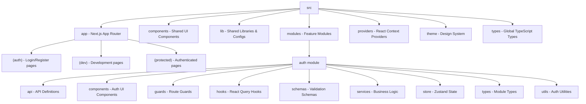

# Fault Lens Frontend Architecture

Here is a graph representing the architectural directory structure of the `fault_lens_fe` application. It follows a modular architecture.



## Directory Tree

```
src/
├── app/                  # Next.js 13+ App Router entry points
│   ├── (auth)/           # Authentication routes (login, register)
│   ├── (dev)/            # Development-only routes
│   └── (protected)/      # Authenticated/Protected routes
├── components/           # Global shared UI components
├── constants/            # Global constants and env config
├── lib/                  # Library configurations (e.g., Axios setup)
├── modules/              # Feature-driven modular architecture
│   └── auth/             # Authentication feature module
│       ├── api/          # Network requests to backend
│       ├── components/   # Specific UI components for auth
│       ├── guards/       # Route protection guards
│       ├── hooks/        # Data-fetching and logic hooks
│       ├── schemas/      # Zod validation schemas
│       ├── services/     # Business logic layer
│       ├── store/        # Zustand state management
│       ├── types/        # TypeScript interfaces for auth
│       └── utils/        # Auth helper functions
├── providers/            # React context providers (e.g. AuthProvider)
├── theme/                # UI theme and styling definitions
└── types/                # Global TypeScript definitions
```
